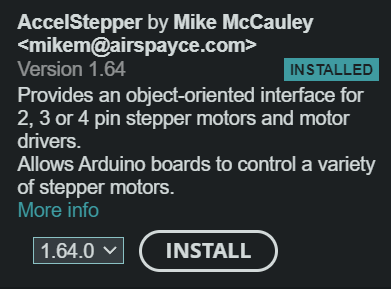

To upload onto the board, open the stepper_motor_controller.ino file in arduino IDE. Make sure the AccelStepper library by Mike McCauley is installed in your arduino ide library manager. 
The library should look like this:  

