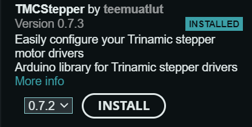

Open Marlin/Marlin.ino in the arduino ide to make any configuration changes. Currently congifured for the Einsy RAMBo 1.2 board.
Make sure the TMCStepper library by teemuatlut is installed in your arduino ide library manager. 
The library should look like this:  

